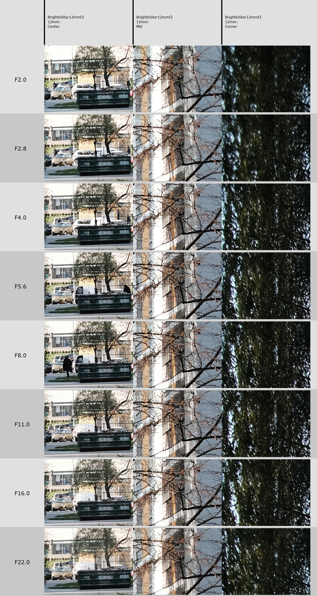

# lenscomparator
Quicker lens comparing.

# Intro

Okay, so imagine you wanna compare a lens. Against itself, against something else.
What does a typical photog do?
Put in a roll of Foma 100, shoot at different apertures, and compare on darkroom prints with a magnifying glass.
That's wasteful of both resources, and your time.

Here's what you have to do now:
1. Set up a tripod and your testing scene.
2. Use a digital camera.
3. Shoot the lens at various apertures.
4. (If the lens is unchipped and does not communicate with the body, make sure the file format is correct).
5. Gather all the results and put them in a one folder.
6. Point the script to the folder.
7. Compare results by eye.

Requires Python 3.something (I ran it on 3.7) and ``pillow`` package.

Seems like more steps, no? I assure you, they're all much shorter.

Of course it's not as flexible as going through the images side by side in Lightroom, but it's not supposed to be.

Yes, it supports JPEGs, not RAWs. I don't think it will ever support RAWs. TIFFs however are a fairer game (as in, if someone asked very nicely or donated something, I could add it within a day). Yes, JPEGs have corrections baked in. Makes it even more incredible when Chinese lenses beat (at least in sharpness) official Fujinons 8)

# Examples 

150usd ultrawide for fuji, how bad can it be?

Let's test it out.
Files were named ``BrightinStar12mmf2_12_<aperture>.JPG`` and put into ``bs12mm`` folder.

Program was called: ``python lenscomparator.py -mk -m -kp 0,0 bs12mm``

Marked image:


Results from the comparison:


Oh well. Center/mid are certainly usable across all ranges, although it truly gets sharp from f4 onwards. Corners are soft as hell, though, by f11 I would call them OK. I assume there's field curvature at play (later testing did prove that, could fiddle with focusing to make corners better probably).
Anyway. That's how it is used. Took me 20 minutes in total. Similar comparison done with the help of lightroom and photoshop would take me an hour, if not more, of just editing.

# help message

I'm a lazy fuck and I won't explain usage in readme again.

```
λ python lenscomparator.py -h
usage: lenscomparator.py [-h] [-m] [-cp CENTERPOS] [-mp MIDPOS] [-kp CORNERPOS] [-cw CROPWIDTH] [-ch CROPHEIGHT] [-mk] folders [folders ...]

Lens comparator app.

positional arguments:
  folders               Required, folder with comparison files. If there is no EXIF data in JPEG files, please use following naming format:
                        LENSNAME_FOCALLENGTH_APERTURE.JPG, where lensname is anything and may include focal length e.g. for zooms.
                        Focal length includes actual focal length the shot was shot at.
                        Aperture however is either an integer, or a float with one dot.
                        e.g. Pergear35f1.6_33_2.8.jpg

optional arguments:
  -h, --help            show this help message and exit
  -m, --merge           If present, will merge all lens comparison across different fields (useful if testing one lens)
  -cp CENTERPOS, --centerpos CENTERPOS
                        Override of default center comparison location at 50, 50% of the image.
                        Format: xpos,ypos e.g. 50,50
  -mp MIDPOS, --midpos MIDPOS
                        Override of default mid comparison location at 70, 30% (upper right) of the image.
                        Format: xpos,ypos e.g. 25,75
  -kp CORNERPOS, --cornerpos CORNERPOS
                        Override of default mid comparison location at 100, 0% (far right) of the image.
                        Format: xpos,ypos e.g. 5,95
  -cw CROPWIDTH, --cropwidth CROPWIDTH
                        Tested crop width in px. Default: 400
  -ch CROPHEIGHT, --cropheight CROPHEIGHT
                        Tested crop height in px. Default: 300
  -mk, --mark           Mark one of the images with tested spots.
  ```
